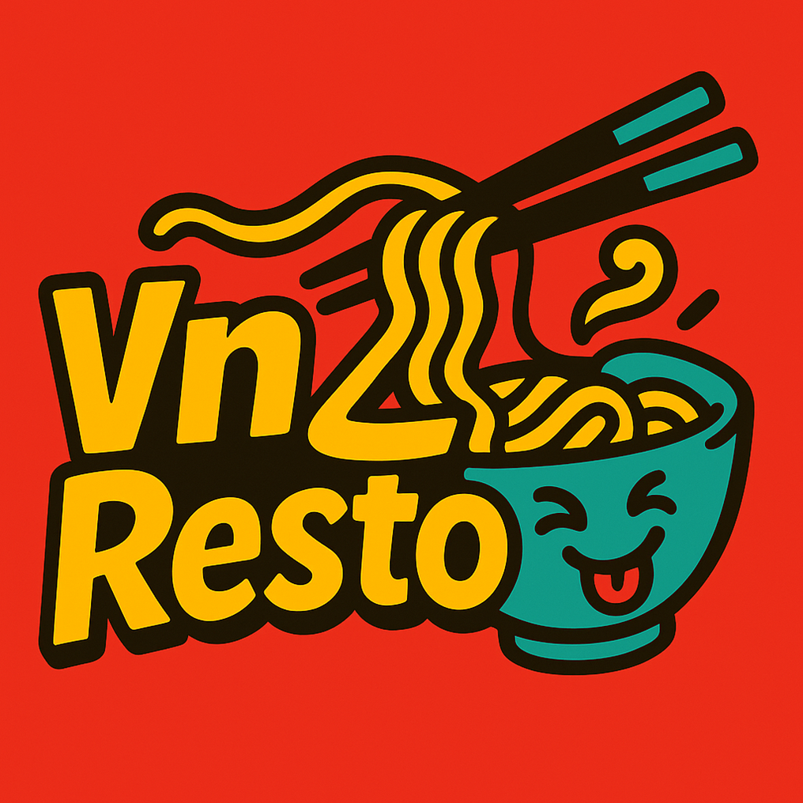

# 🍜 VnZResto — Vietnamese Restaurant Ordering App



**VnZResto** is a modern Android-based e-commerce app for a Vietnamese restaurant.  
It allows customers to browse the menu, place orders, and manage their accounts, while the admin panel handles menu management and order tracking.

---

## 🌟 Features

### 👤 User Panel
- Login / Register / Forgot Password  
- Browse food categories and dishes  
- Add to cart and place orders    
- View order history  

### 🛠 Admin Panel
- Manage menu (add/edit/delete dishes)  
- View all orders    
- Manage customers  

---

## 🧱 Tech Stack

| Category | Technologies |
|-----------|---------------|
| Language | Java |
| Framework | Android SDK |
| Database | Firebase Realtime Database / Firestore|
|Authentication |Firebase Auth|
| UI | XML (LinearLayout, CardView, ConstraintLayout) |
| Tools | Android Studio, Git, GitHub |
| Version Control | Git + GitHub |

---
## 🧑‍💻 Author

**👩 Naomi Pham (Phạm Ngọc Yến Nhi)**  
🎓 Computer Science Student at **LaSalle College**, Montreal, QC   
💼 Aspiring Android Developer passionate about mobile app design and UX/UI  
🔥 Focused on creating modern, meaningful apps that connect culture and technology  

📫 **Connect with me:**  
- 🌐 [GitHub](https://github.com/NaomiPhamm)  
- 💼 [LinkedIn](https://www.linkedin.com/in/naomi-pham-69292b333/)
- ✉️ [Email](phamngocyennhi.work@gmail.com)


## ⚙️ Installation & Setup

1. **Clone this repository**
   ```bash
   git clone https://github.com/NaomiPhamm/VnZResto.giso i create a screeshorts folder right but where the folder belong to 
